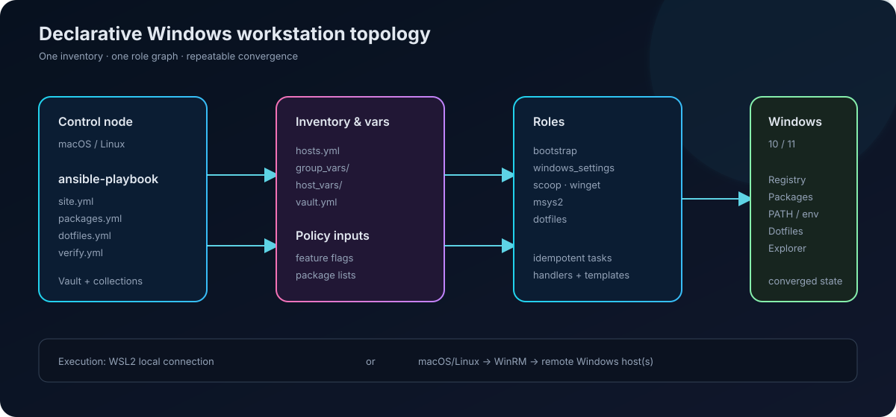
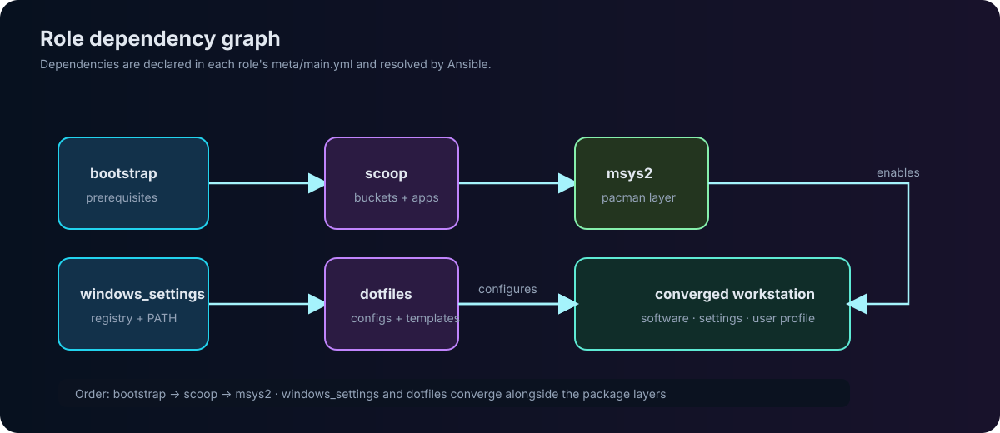
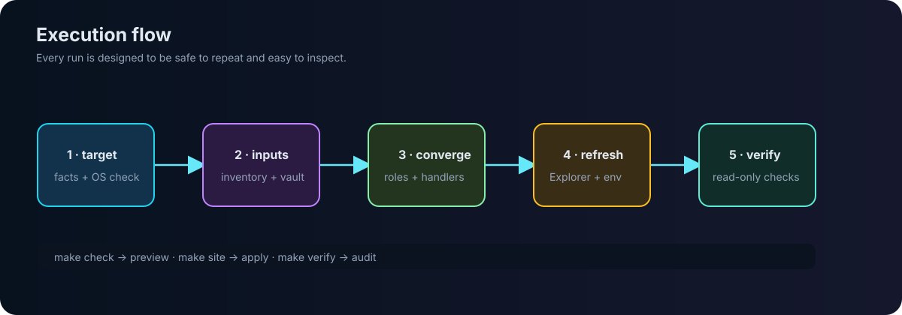

<h1 align="center">playbooks-4-windows</h1>

<p align="center">
  Declarative, repeatable Windows workstation provisioning with Ansible.
</p>

<p align="center">
  <a href="https://github.com/DivitMittal/playbooks-4-windows"></a>
  
  
  <a href="LICENSE"></a>
</p>

<p align="center">
  <a href="#quick-start">Quick start</a> ·
  <a href="#architecture">Architecture</a> ·
  <a href="#repository-map">Repository map</a> ·
  <a href="#workflows">Workflows</a>
</p>

---

## Contents

- [Overview](#overview)
- [Quick start](#quick-start)
- [Architecture](#architecture)
- [Repository map](#repository-map)
- [Roles and managed state](#roles-and-managed-state)
- [Feature flags](#feature-flags)
- [Workflows](#workflows)
- [Adding another host](#adding-another-host)
- [Secrets](#secrets)
- [Relationship to OS-nixCfg](#relationship-to-os-nixcfg)

## Overview

This repository is the Windows layer of a personal, multi-machine configuration system. It turns a fresh Windows 10/11 workstation into a consistent development environment by managing:

- Scoop, Winget, and MSYS2 packages
- registry, Explorer, power, privacy, PATH, and environment settings
- PowerShell, Git, Starship, WezTerm, Firefox, Tridactyl, whkd, and Fastfetch configuration
- local WSL2 execution or remote WinRM execution

The desired state lives in YAML, role defaults, registry tasks, and Jinja2 templates. Every task is intended to be idempotent: running the same playbook again should converge the machine without duplicating work.

## Quick start

### 1. Prepare the control node

Use macOS/Linux, or run the control node inside WSL2 on the Windows target:

```bash
bash scripts/install-ansible.sh
```

The script creates the Python environment and installs the pinned Ansible collections. The manual equivalent is:

```bash
pip install -r requirements.txt
ansible-galaxy collection install -r requirements.yml -p .collections/
```

### 2. Configure credentials

Only WinRM authentication and personal Git settings belong in the encrypted vault:

```bash
make init-vault-pass
make edit-vault
```

Never commit `.vault_pass` or plaintext vault content.

### 3. Choose the connection

The default host in `inventory/hosts.yml` uses a local WSL2 connection. For a remote machine, configure the host for WinRM and run this on the Windows target as Administrator:

```powershell
.\scripts\bootstrap-winrm.ps1
```

### 4. Apply the configuration

```bash
make deps
make bootstrap
make site
make verify
```

Preview changes first with `make check`.

## Architecture

The control node loads inventory and variables, then Ansible resolves the role graph and converges each host in the `windows` inventory group. Add a host to that group and the existing roles apply automatically.

<p align="center">
  
</p>

### Role dependency topology

`meta/main.yml` declares dependencies; the graph below shows the effective provisioning shape.

<p align="center">
  
</p>

### Execution topology

Each `site.yml` run validates the target, loads policy inputs, converges roles, refreshes dependent processes, and flushes handlers before reporting completion.

<p align="center">
  
</p>

## Repository map

```text
.
├── ansible.cfg                 # transport, vault path, fact cache, forks
├── Makefile                    # primary command interface
├── requirements.yml            # Ansible collections
├── scripts/
│   ├── bootstrap-winrm.ps1     # enable WinRM on a remote target
│   └── install-ansible.sh      # prepare the control node
├── inventory/
│   ├── hosts.yml               # all managed Windows hosts
│   ├── host_vars/              # per-host overrides
│   └── group_vars/
│       ├── all/                # feature flags and encrypted vault
│       └── windows/            # paths and package catalogues
├── playbooks/
│   ├── site.yml                # complete convergence
│   ├── bootstrap.yml           # first-machine setup
│   ├── packages.yml            # package layers only
│   ├── dotfiles.yml            # user configuration only
│   ├── update.yml              # package upgrades
│   └── verify.yml              # read-only checks
├── roles/
│   ├── bootstrap/
│   ├── windows_settings/
│   ├── scoop/
│   ├── winget/
│   ├── msys2/
│   └── dotfiles/
└── assets/                    # README topology SVGs
```

## Roles and managed state

| Role | Responsibility |
| --- | --- |
| `bootstrap` | PowerShell policy, NuGet/PSGallery trust, Scoop installation, XDG directories, optional WinRM configuration |
| `windows_settings` | Registry, privacy, Developer Mode, taskbar, power plan, Explorer, PATH, and environment variables |
| `scoop` | Scoop buckets and command-line packages |
| `winget` | GUI applications and Microsoft ecosystem packages |
| `msys2` | MSYS2 `pacman` packages using a login Bash environment |
| `dotfiles` | Static files and rendered templates for the user profile |

Important settings include the Office/Hyper-key registry override, which prevents `Ctrl+Alt+Shift+Win` from launching Microsoft 365, while preserving ordinary Windows shortcuts.

## Feature flags

Global switches live in `inventory/group_vars/all/main.yml`:

```yaml
feature_scoop:            true
feature_winget:           true
feature_msys2:            true
feature_wezterm:          true
feature_starship:         true
feature_firefox:          true
feature_tridactyl:        true
feature_whkd:             true
feature_kanata:           false  # legacy
feature_windows_settings: true
feature_git_config:       true
```

Set a flag to `false` to skip that subsystem. Put machine-specific values such as `is_laptop` in `inventory/host_vars/<hostname>.yml`.

## Workflows

| Command | Purpose |
| --- | --- |
| `make deps` | Install Python dependencies and Ansible collections |
| `make bootstrap` | Prepare a fresh Windows machine |
| `make site` | Apply the complete configuration |
| `make check` | Dry-run with diff output |
| `make verify` | Run read-only state checks |
| `make packages` | Ensure Scoop, Winget, and MSYS2 packages |
| `make dotfiles` | Deploy user configuration only |
| `make update` | Upgrade managed packages |
| `make lint` | Run ansible-lint |

Run only a slice of the site:

```bash
ansible-playbook playbooks/site.yml --tags settings
ansible-playbook playbooks/site.yml --tags wezterm,starship
ansible-playbook playbooks/site.yml --skip-tags firefox
ansible-playbook playbooks/verify.yml --tags settings
```

## Adding another host

1. Add the machine below `windows:` in `inventory/hosts.yml`.
2. Select `local` or `winrm` connection variables.
3. Add optional overrides in `inventory/host_vars/<hostname>.yml`.
4. Run `ansible-playbook playbooks/site.yml --limit <hostname>`.

No role changes are required: the playbooks target the `windows` group.

## Secrets

`inventory/group_vars/all/vault.yml` is encrypted with `ansible-vault`. Tasks consume the clean aliases defined in `inventory/group_vars/windows/main.yml`, not `vault_*` variables directly.

| Secret | Use |
| --- | --- |
| `vault_git_email` | Git identity |
| `vault_git_signing_key` | Git signing |
| `vault_windows_user` | WinRM username |
| `vault_windows_password` | WinRM password |

```bash
make edit-vault
ansible-vault rekey inventory/group_vars/all/vault.yml
```

## Relationship to OS-nixCfg

[`OS-nixCfg`](https://github.com/DivitMittal/OS-nixCfg) is the declarative Nix configuration for the macOS, Linux/NixOS, WSL, and Android sides of the environment. This repository is its Windows workstation counterpart: Ansible owns the Windows boot, packages, registry, environment, and dotfiles while the Nix repository owns the Unix-like hosts and their topology.

## License

MIT — see [LICENSE](LICENSE).
